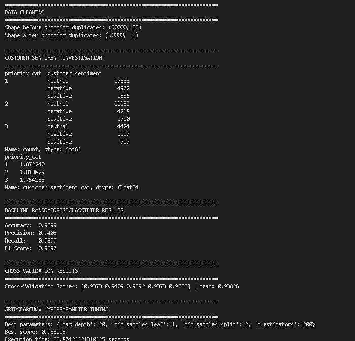
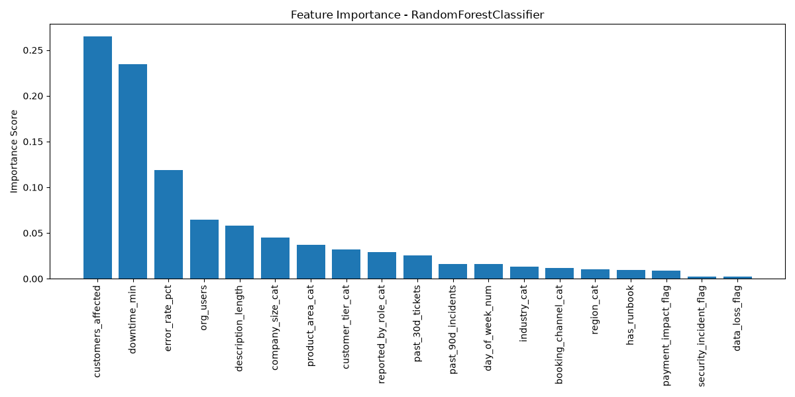
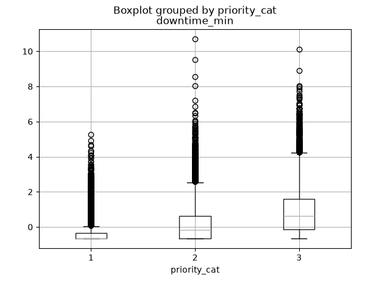
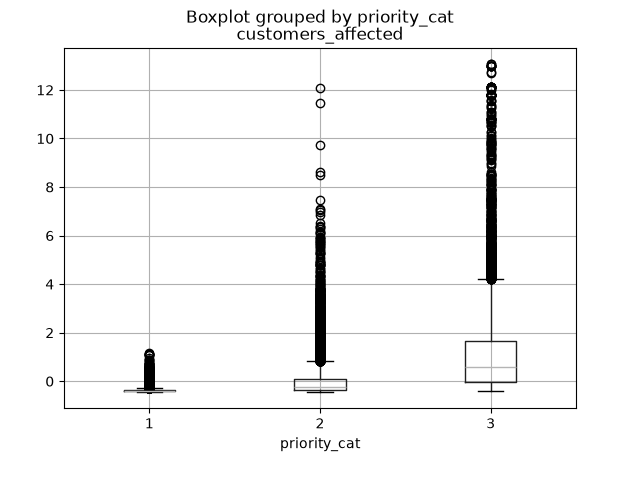

# Support Ticket Priority Prediction

A machine learning model that predicts whether an incoming support ticket should be **low**, **medium**, or **high** priority, so urgent issues get flagged before they sit in a first-come, first-served queue.

## The Problem

Support teams usually decide a ticket's priority only when they reach it in the queue. When the queue is long, a high-priority ticket (an outage, a security incident) can get stuck behind dozens of routine requests. Predicting priority at submission time lets urgent tickets get routed to an available team right away.

## Results

A Random Forest classifier trained on 50,000 tickets:

| Metric | Score |
|---|---|
| Accuracy | **93.99%** |
| Precision (weighted) | 94.03% |
| Recall (weighted) | 93.99% |
| F1 score (weighted) | 93.97% |
| 5-fold cross-validation (mean accuracy) | 93.83% |

Cross-validation scores stayed within about 0.4% of each other across folds, so the model's performance holds up across different splits of the data. Hyperparameter tuning with `GridSearchCV` (best: 200 trees, max depth 20, 93.5% CV accuracy) didn't beat the baseline, which suggests the default model was already well fit.



## What Drives Priority

Impact on customers matters most: the number of **customers affected**, **downtime**, and **error rate** carry the majority of the model's predictive weight.



Higher-priority tickets show clearly higher downtime and customer impact:

| Downtime by priority | Customers affected by priority |
|---|---|
|  |  |

*(Priority 1 = low, 2 = medium, 3 = high. Values are standardized.)*

One notable finding: **customer sentiment had almost no relationship to priority**. The mix of negative, neutral, and positive tickets was similar at every priority level, so an angry customer isn't a reliable signal of an urgent issue.

## Tech Stack

- Python 3.14
- pandas, scikit-learn, matplotlib (exact versions pinned in `requirements.txt`)

## Running It

1. Download the dataset from Kaggle: [Support Ticket Priority Dataset (50K)](https://www.kaggle.com/datasets/albertobircoci/support-ticket-priority-dataset-50k). This is a synthetic dataset with no real customer data. Place `Support_tickets.csv` in the project root.
2. Install dependencies:
   ```
   pip install -r requirements.txt
   ```
3. Run:
   ```
   python predict_priority.py
   ```

The full run takes about 60–90 seconds, mostly for hyperparameter tuning. Charts and sample outputs are written to an `output/` folder.

## License

© 2026 Natnael Gebremeden. All rights reserved.

This repository is shared for portfolio viewing only. No license is granted to copy, modify, or submit this code, in whole or in part, as your own work.
